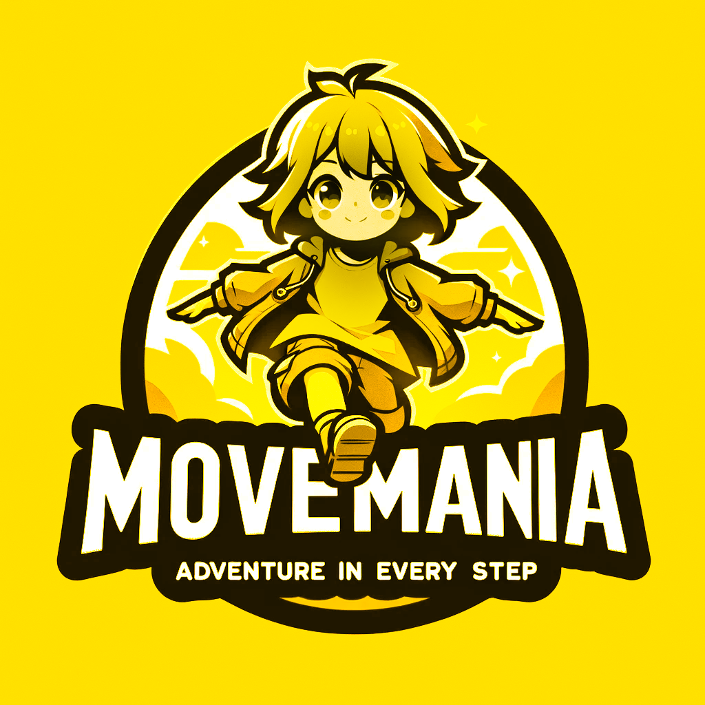

# MoveMania

  Junction 2023 Hackathon Project

  

## Description

MoveMania: The Adventure in Every Step!

During the crucial years of childhood, feeling connected, receiving support, and forging new friendships are vital for a child's happiness and overall development. The sense of unity and shared spirit among classmates plays a significant role in this journey. To foster this, we proudly introduce MoveMania!

MoveMania is an exciting game designed to boost the well-being of school-age children by promoting physical activity and community spirit. More than just a game, it inspires adventure, teamwork, and being active among kids.

How MoveMania Works Its Magic:

- Team Building: Classes form their unique teams.
- Exploration and Rewards: Every step unlocks new adventures and treasures (e.g. coins, gems, and more).
- Celebrating Milestones: Completing levels triggers special moments where players can celebrate their classmates with unique compliment badges, acknowledging their strengths and achievements.
- Team Power: Walking together magnifies the fun! As the group moves in sync, they activate a 'boost' feature, making it easier to find rewards and conquer levels. This shared activity fosters excitement and team spirit.

MoveMania isn't just a game; it's a shared journey of discovery and joy. Each step not only brings excitement but also strengthens the community's bonds. Join us on the MoveMania adventure, where every step counts toward a happier, healthier community!

## Technical Approach

A working game built with React Native, MoveMania leverages GPS coordinate data from users' devices. Our solution is not limited to mobile use and can extend to other movement-tracking wearables.

Key Features:

- Adaptable Reward System: Easily tweak reward types and probabilities via the app's settings without altering the core reward engine.
- H3 Library Integration: Utilizing the H3 library for intricate tile logic on standard maps.
- Creative Progress Bar: Designed to flexibly gamify movement data and achieved rewards.

*Note: Our demo solution has no backend. To run app successfully in a real scenario backend is needed to store user related data and communicate coordinates between the users.*

## Post-Junction Roadmap

1. Developing essential technical services, like a backend for user data storage and coordinate communication.
2. Utilizing higher-resolution movement data for more dynamic gameplay.
3. Exploring alternative movement data, such as accelerometer input.
4. Empowering teams to create custom levels, rewards, and compliments to tailor the game to their preferences.
